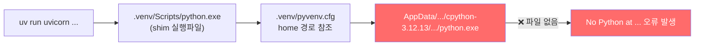
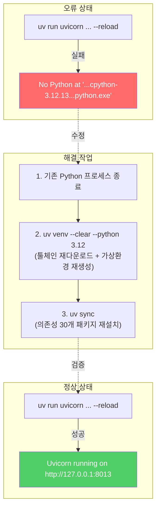

# filing-agent 서버 실행 오류 분석 및 해결 보고서

**프로젝트**: filing-agent (DART 기반 재무 질의응답 어시스턴트)
**일시**: 2026-06-25
**환경**: Windows x86_64 / Python 3.12 / uv 패키지 매니저

---

## 1. 오류 현상

터미널에서 서버 실행 명령어 입력 시, Python 인터프리터를 찾지 못하는 오류가 발생하여 서버가 시작되지 않았습니다.

### 실행 명령어

```bash
uv run uvicorn filing_agent.api.main:app --reload
```

### 오류 메시지

```
No Python at '"C:\Users\Playdata\AppData\Roaming\uv\python\cpython-3.12.13-windows-x86_64-none\python.exe'
```

### 오류 스크린샷

> 동일한 명령어를 두 번 실행하였으나, 두 번 모두 같은 오류 메시지가 출력됨

---

## 2. 원인 분석

### 직접 원인

프로젝트의 가상환경(`.venv`)이 참조하는 **원본 Python 인터프리터 파일이 시스템에서 누락**되어 있었습니다.

### 상세 메커니즘



| 항목 | 내용 |
|------|------|
| **가상환경 설정 파일** | `.venv/pyvenv.cfg` |
| **참조 경로** | `C:\Users\Playdata\AppData\Roaming\uv\python\cpython-3.12.13-windows-x86_64-none` |
| **문제** | 위 경로에 Python 실행 파일이 존재하지 않음 (삭제 또는 미설치 상태) |

### 추정 원인

- `uv`의 Python 툴체인 캐시가 삭제되었거나, 다른 작업 중 해당 디렉토리가 제거된 것으로 추정
- Windows에서 `uv`는 `AppData\Roaming\uv\python\` 하위에 Python 버전별 바이너리를 관리하는데, 이 캐시가 유실되면 기존 가상환경이 일괄적으로 깨지게 됨

---

## 3. 해결 과정

> [!IMPORTANT]
> 프로젝트의 소스 코드 및 디렉토리 구조는 일체 변경하지 않았습니다.
> 가상환경(`.venv`)과 Python 툴체인만 복구하였습니다.

### Step 1: 기존 프로세스 정리

가상환경 내부의 파일을 잠금(lock)하고 있던 기존 Python/Uvicorn 프로세스를 확인하고 종료했습니다.

```powershell
# 실행 중인 Python 프로세스 확인
Get-CimInstance Win32_Process -Filter "Name = 'python.exe'" | Select-Object ProcessId, CommandLine

# .venv 경로를 사용하는 프로세스 강제 종료
Get-Process -Name python | Where-Object { $_.Path -like "*\.venv\*" } | Stop-Process -Force
```

| PID | 경로 | 설명 |
|-----|------|------|
| 4676 | `.venv\Scripts\python.exe` | uvicorn 서버 (port 8013) |
| 22044 | `.venv\Scripts\python.exe` | uvicorn 서버 (--reload) |
| 23260 | `.venv\Scripts\python.exe` | uvicorn 서버 (--reload) |
| 13548, 18460, 22468 | `uv\python\cpython-3.12.13\...` | 워커 프로세스 |

> [!NOTE]
> 프로세스를 먼저 종료하지 않으면 `.venv\Scripts\` 디렉토리에 파일 잠금이 걸려 가상환경 재생성이 실패합니다.
> (`액세스가 거부되었습니다. os error 5`)

### Step 2: Python 3.12 툴체인 다운로드 및 가상환경 재생성

```powershell
uv venv --clear --python 3.12
```

**결과:**
```
Using CPython 3.12.13
Creating virtual environment at: .venv
Activate with: .venv\Scripts\activate
```

- `uv`가 누락된 `cpython-3.12.13`을 자동으로 다시 다운로드 (20.9MB)
- `--clear` 옵션으로 깨진 기존 `.venv`를 제거하고 새로 생성

### Step 3: 프로젝트 의존성 동기화

```powershell
uv sync
```

**결과:**
```
Resolved 31 packages in 1ms
Installed 30 packages in 326ms
```

`pyproject.toml`에 정의된 모든 의존성이 정상 설치되었습니다:

| 주요 패키지 | 버전 |
|-------------|------|
| fastapi | 0.138.0 |
| uvicorn | 0.49.0 |
| httpx | 0.28.1 |
| pydantic-settings | 2.14.2 |
| python-dotenv | 1.2.2 |
| pytest | 9.1.1 |
| ruff | 0.15.19 |

### Step 4: 서버 구동 검증

```powershell
uv run uvicorn filing_agent.api.main:app --port 8013
```

**결과:**
```
INFO:     Started server process [24676]
INFO:     Waiting for application startup.
INFO:     Application startup complete.
INFO:     Uvicorn running on http://127.0.0.1:8013 (Press CTRL+C to quit)
```

✅ **서버가 정상적으로 시작되는 것을 확인하였습니다.**

---

## 4. 요약



| 항목 | 내용 |
|------|------|
| **문제** | uv의 Python 툴체인 캐시 누락으로 가상환경이 깨짐 |
| **영향 범위** | 서버 실행 불가 (소스 코드에는 영향 없음) |
| **해결 방법** | 프로세스 정리 → 가상환경 재생성 → 의존성 동기화 |
| **소스 코드 변경** | 없음 |
| **소요 시간** | 약 5분 |

---

## 5. 재발 방지 참고사항

> [!TIP]
> - `uv`의 Python 툴체인은 `%APPDATA%\uv\python\` 에 캐시되므로, 디스크 정리 도구 등으로 해당 경로가 삭제되지 않도록 주의합니다.
> - 동일 오류 재발 시, 위 Step 2~3 (`uv venv --clear --python 3.12` → `uv sync`) 두 명령어만 순서대로 실행하면 복구됩니다.
> - 단, 기존에 uvicorn 등 서버가 실행 중이라면 먼저 종료해야 합니다.
